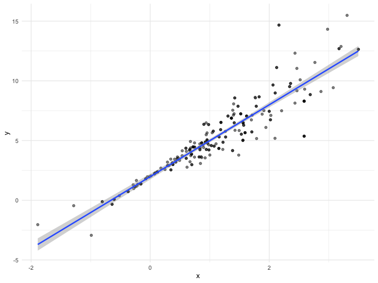
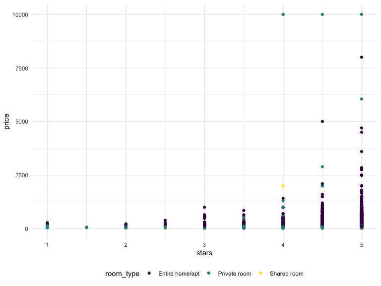

Bootstrapping
================
Olya Besedina

``` r
n_samp = 250

sim_df_const = 
  tibble(
    x = rnorm(n_samp, 1, 1),
    error = rnorm(n_samp, 0, 1),
    y = 2 + 3 * x + error
  )

sim_df_nonconst = sim_df_const %>% 
  mutate(
  error = error * .75 * x,
  y = 2 + 3 * x + error
)
```

``` r
sim_df = 
  bind_rows(const = sim_df_const, nonconst = sim_df_nonconst, .id = "data_source") 

sim_df %>% 
  ggplot(aes(x = x, y = y)) + 
  geom_point(alpha = .5) +
  stat_smooth(method = "lm") +
  facet_grid(~data_source) 
```


Fit two models

``` r
sim_df_const %>% 
  lm(y ~ x, data = .) %>% 
  broom::tidy()
```

    ## # A tibble: 2 x 5
    ##   term        estimate std.error statistic   p.value
    ##   <chr>          <dbl>     <dbl>     <dbl>     <dbl>
    ## 1 (Intercept)     1.98    0.0981      20.2 3.65e- 54
    ## 2 x               3.04    0.0699      43.5 3.84e-118

``` r
sim_df_nonconst %>% 
  lm(y ~ x, data = .) %>% 
  broom::tidy()
```

    ## # A tibble: 2 x 5
    ##   term        estimate std.error statistic   p.value
    ##   <chr>          <dbl>     <dbl>     <dbl>     <dbl>
    ## 1 (Intercept)     1.93    0.105       18.5 1.88e- 48
    ## 2 x               3.11    0.0747      41.7 5.76e-114

error distribution is different between the sets, but var is the same.

# How can I bootstrap

write a function to draw a bootstrap sample based on a dataframe size =
1 , size what you are taking, 1 is 100%

``` r
# w/o replacement
sim_df_nonconst %>% 
  sample_frac(size = 1, replace = FALSE) %>% 
  arrange(x)
```

    ## # A tibble: 250 x 3
    ##         x  error      y
    ##     <dbl>  <dbl>  <dbl>
    ##  1 -1.89   1.62  -2.04 
    ##  2 -1.29   1.40  -0.454
    ##  3 -1.21  -0.781 -2.43 
    ##  4 -1.00   0.832 -0.169
    ##  5 -0.989 -1.97  -2.93 
    ##  6 -0.914 -0.908 -1.65 
    ##  7 -0.805  0.292 -0.123
    ##  8 -0.733  0.447  0.248
    ##  9 -0.665 -0.544 -0.539
    ## 10 -0.641 -0.416 -0.338
    ## # … with 240 more rows

``` r
# w replacement
sim_df_nonconst %>% 
  sample_frac(size = 1, replace = TRUE) %>% 
  arrange(x)
```

    ## # A tibble: 250 x 3
    ##         x   error      y
    ##     <dbl>   <dbl>  <dbl>
    ##  1 -1.89   1.62   -2.04 
    ##  2 -1.21  -0.781  -2.43 
    ##  3 -1.00   0.832  -0.169
    ##  4 -0.914 -0.908  -1.65 
    ##  5 -0.914 -0.908  -1.65 
    ##  6 -0.914 -0.908  -1.65 
    ##  7 -0.805  0.292  -0.123
    ##  8 -0.665 -0.544  -0.539
    ##  9 -0.536  0.0227  0.413
    ## 10 -0.536  0.0227  0.413
    ## # … with 240 more rows

``` r
boot_sample = function(df) {
  sample_frac(df, replace = TRUE)
}
```

``` r
boot_sample(df = sim_df_nonconst) %>% 
  ggplot(aes(x = x, y= y))+
  geom_point(alpha = .5)+ 
  stat_smooth(method = "lm")
```



Can i create a df, to keet track of boot strap sample?

Orginize a dataframe.. rerun boot\_sample(sim\_df\_nonconst) a 1000
times

sample with replacement - gives you a diff sample of 250 people from the
same sample, because some of the people will be picked more than once.

``` r
boot_straps = 
  tibble(
    strap_number = 1:1000,
    strap_sample = rerun(1000, boot_sample(sim_df_nonconst))
  )

boot_straps
```

    ## # A tibble: 1,000 x 2
    ##    strap_number strap_sample      
    ##           <int> <list>            
    ##  1            1 <tibble [250 × 3]>
    ##  2            2 <tibble [250 × 3]>
    ##  3            3 <tibble [250 × 3]>
    ##  4            4 <tibble [250 × 3]>
    ##  5            5 <tibble [250 × 3]>
    ##  6            6 <tibble [250 × 3]>
    ##  7            7 <tibble [250 × 3]>
    ##  8            8 <tibble [250 × 3]>
    ##  9            9 <tibble [250 × 3]>
    ## 10           10 <tibble [250 × 3]>
    ## # … with 990 more rows

Do some kind of analysis

What is the distribution of the slope

``` r
bootstrap_results = 
  boot_straps %>% 
  mutate(
    models = map(.x = strap_sample, ~lm(y ~x, data = .x)),
    results = map(models, broom::tidy)
  ) %>% 
  select(- strap_sample, - models) %>% 
  unnest(results)
```

summarize these results

``` r
bootstrap_results %>% 
  group_by(term) %>% 
  summarize(se = sd(estimate))
```

    ## # A tibble: 2 x 2
    ##   term            se
    ##   <chr>        <dbl>
    ## 1 (Intercept) 0.0743
    ## 2 x           0.0999

# Try modelr package

``` r
boot_straps = 
  sim_df_nonconst %>% 
  modelr::bootstrap(n = 1000)

sim_df_nonconst %>% 
  modelr::bootstrap(n = 1000) %>% 
  mutate(
    models = map(strap, ~lm(y ~ x, data = .x) ),
    results = map(models, broom::tidy)) %>% 
  select(-strap, -models) %>% 
  unnest(results) %>% 
  group_by(term) %>% 
  summarize(boot_se = sd(estimate))
```

    ## # A tibble: 2 x 2
    ##   term        boot_se
    ##   <chr>         <dbl>
    ## 1 (Intercept)  0.0773
    ## 2 x            0.101

# what if your assumptions are not wrong?

``` r
sim_df_const %>% 
  modelr::bootstrap(n = 1000) %>% 
  mutate(
    models = map(strap, ~lm(y ~ x, data = .x) ),
    results = map(models, broom::tidy)) %>% 
  select(-strap, -models) %>% 
  unnest(results) %>% 
  group_by(term) %>% 
  summarize(boot_se = sd(estimate))
```

    ## # A tibble: 2 x 2
    ##   term        boot_se
    ##   <chr>         <dbl>
    ## 1 (Intercept)  0.0994
    ## 2 x            0.0732

Good for data that does not meet the assumptions.

# airbnb data

``` r
data("nyc_airbnb")

nyc_airbnb = 
  nyc_airbnb %>% 
  mutate(stars = review_scores_location / 2) %>% 
  rename(
    boro = neighbourhood_group,
    neighborhood = neighbourhood) %>% 
  filter(boro != "Staten Island") %>% 
  select(price, stars, boro, neighborhood, room_type)
```

``` r
nyc_airbnb %>% 
  ggplot(aes(x = stars, y = price, color = room_type)) + 
  geom_point()
```



error are not constant. regression assumptions are not valid. what is
distribution of the slope?

Reuse the stuff I just did

``` r
airbnb_results = 
  nyc_airbnb %>% 
  filter(boro == "Manhattan") %>% 
  modelr::bootstrap(n = 1000) %>% 
  mutate(
    models = map(strap, ~lm(price ~ stars, data = .x) ),
    results = map(models, broom::tidy)) %>% 
  select(-strap, -models) %>% 
  unnest(results) %>% 
  filter(term == "stars") %>% 
  ggplot(aes(x = estimate)) + geom_density()
```

Distribution is skewed. does not ~N distribution. 95% CI will be your
data with out 2.5% from bottom and top
