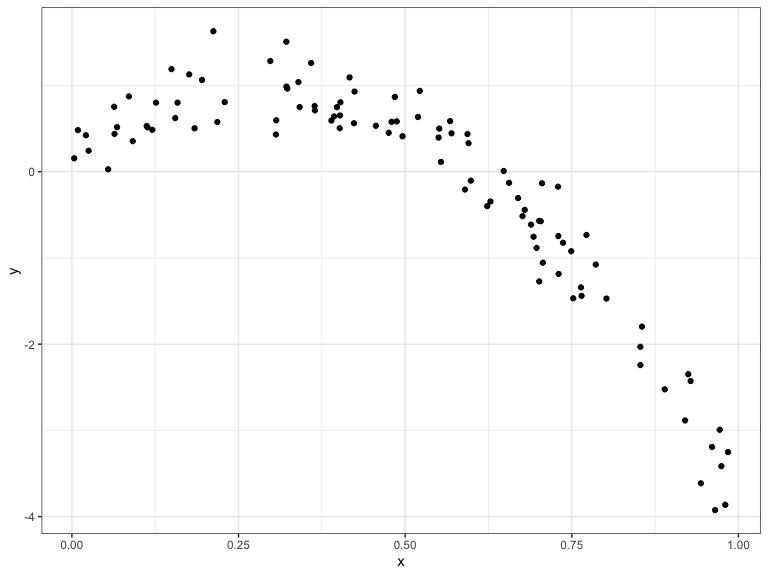
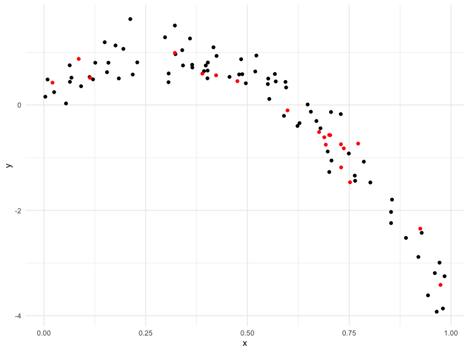
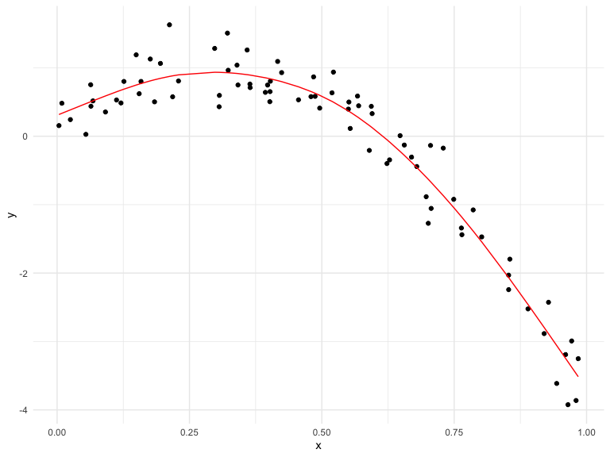
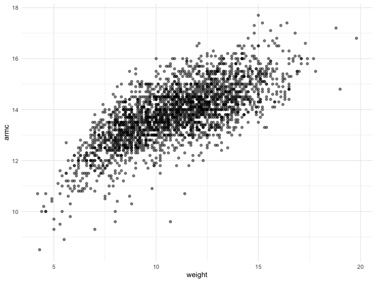

Cross Validation
================
Olya Besedina

AIC BIC

Generate non linear df

``` r
nonlin_df = 
  tibble(
    id = 1:100,
    x = runif(100, 0, 1),
    y = 1 - 10 * (x - .3) ^ 2 + rnorm(100, 0, .3)
  )

nonlin_df %>% 
  ggplot(aes(x = x, y = y)) + 
  geom_point() + theme_bw()
```



Training and testing

anti\_join = give me everything that appears in one df, but not the
other. So from nonlin\_df give me everything that does not appear in
train\_df.

``` r
train_df = sample_frac(nonlin_df, size = .80)
test_df = anti_join(nonlin_df, train_df, by = "id")

ggplot(train_df, aes(x = x, y = y)) + 
  geom_point() + 
  geom_point(data = test_df, color = "red")
```



Fit three models of varying goodness

``` r
linear_mod = lm(y ~ x, data = train_df)
smooth_mod = mgcv::gam(y ~ s(x), data = train_df)
wiggly_mod = mgcv::gam(y ~ s(x, k = 30), sp = 10e-6, data = train_df)
```

look at some fits

``` r
train_df %>% 
  add_predictions(smooth_mod) %>% 
  ggplot(aes(x = x, y = y)) + geom_point() + 
  geom_line(aes(y = pred), color = "red")
```



There is no statistical test that can tell you which model is stat
better that another.

Crross validation

Better model is the one that has lower RMSE. Including more var into a
model will decrease your RMSE, but it will be over fitted

``` r
rmse(linear_mod, test_df)
```

    ## [1] 0.5872366

``` r
## [1] 0.7052956
rmse(smooth_mod, test_df)
```

    ## [1] 0.2446613

``` r
## [1] 0.2221774
rmse(wiggly_mod, test_df)
```

    ## [1] 0.3762545

``` r
## [1] 0.289051
```

Have full ds, split ramdomly in training and testing data set 80/20

crossv\_mc = Generate test-training pairs for cross-validation. 80/20 is
the default in this function.

Less memory intensive

``` r
cv_df = 
  crossv_mc(nonlin_df, 100) 
```

Build a model in “train” and test in “test” for 100 resampling?

``` r
cv_df %>% pull(train) %>% .[[1]] %>% as_tibble
```

    ## # A tibble: 79 x 3
    ##       id       x      y
    ##    <int>   <dbl>  <dbl>
    ##  1     2 0.729   -0.174
    ##  2     3 0.693   -0.754
    ##  3     4 0.212    1.63 
    ##  4     5 0.229    0.808
    ##  5     6 0.00350  0.156
    ##  6     7 0.306    0.431
    ##  7     9 0.0639   0.439
    ##  8    12 0.972   -2.99 
    ##  9    13 0.703   -0.574
    ## 10    14 0.984   -3.25 
    ## # … with 69 more rows

Do the same for every row

``` r
cv_df =
  cv_df %>% 
  mutate(
    train = map(train, as_tibble),
    test = map(test, as_tibble))
```

``` r
 cv_df %>% 
  mutate(linear_mod  = map(train, ~lm(y ~ x, data = .x)),
         rmse_linear = map2_dbl(.x = linear_mod, .y = test, ~rmse(.x, .y)))
```

    ## # A tibble: 100 x 5
    ##    train             test              .id   linear_mod rmse_linear
    ##    <list>            <list>            <chr> <list>           <dbl>
    ##  1 <tibble [79 × 3]> <tibble [21 × 3]> 001   <lm>             0.769
    ##  2 <tibble [79 × 3]> <tibble [21 × 3]> 002   <lm>             0.979
    ##  3 <tibble [79 × 3]> <tibble [21 × 3]> 003   <lm>             0.883
    ##  4 <tibble [79 × 3]> <tibble [21 × 3]> 004   <lm>             0.796
    ##  5 <tibble [79 × 3]> <tibble [21 × 3]> 005   <lm>             0.763
    ##  6 <tibble [79 × 3]> <tibble [21 × 3]> 006   <lm>             0.820
    ##  7 <tibble [79 × 3]> <tibble [21 × 3]> 007   <lm>             0.747
    ##  8 <tibble [79 × 3]> <tibble [21 × 3]> 008   <lm>             0.881
    ##  9 <tibble [79 × 3]> <tibble [21 × 3]> 009   <lm>             0.853
    ## 10 <tibble [79 × 3]> <tibble [21 × 3]> 010   <lm>             0.731
    ## # … with 90 more rows

``` r
# For all models 
       
cv_df = 
  cv_df %>% 
  mutate(linear_mod  = map(train, ~lm(y ~ x, data = .x)),
         smooth_mod  = map(train, ~mgcv::gam(y ~ s(x), data = .x)),
         wiggly_mod  = map(train, ~gam(y ~ s(x, k = 30), sp = 10e-6, data = .x))) %>% 
  mutate(rmse_linear = map2_dbl(linear_mod, test, ~rmse(model = .x, data = .y)),
         rmse_smooth = map2_dbl(smooth_mod, test, ~rmse(model = .x, data = .y)),
         rmse_wiggly = map2_dbl(wiggly_mod, test, ~rmse(model = .x, data = .y)))
```

``` r
cv_results = 
  cv_df %>% 
  mutate(linear_mod  = map(train, ~lm(y ~ x, data = .x)),
         smooth_mod  = map(train, ~mgcv::gam(y ~ s(x), data = .x)),
         wiggly_mod  = map(train, ~gam(y ~ s(x, k = 30), sp = 10e-6, data = .x))) %>% 
  mutate(rmse_linear = map2_dbl(linear_mod, test, ~rmse(model = .x, data = .y)),
         rmse_smooth = map2_dbl(smooth_mod, test, ~rmse(model = .x, data = .y)),
         rmse_wiggly = map2_dbl(wiggly_mod, test, ~rmse(model = .x, data = .y)))
```

Visualize models

``` r
cv_results %>% 
  select(starts_with("rmse")) %>% 
  pivot_longer(
    everything(),
    names_to = "model", 
    values_to = "rmse",
    names_prefix = "rmse_") %>% 
  mutate(model = fct_inorder(model)) %>% 
  ggplot(aes(x = model, y = rmse)) + geom_violin()
```

Examples

``` r
child_growth = read_csv("./data/nepalese_children.csv")
```

    ## Parsed with column specification:
    ## cols(
    ##   age = col_double(),
    ##   sex = col_double(),
    ##   weight = col_double(),
    ##   height = col_double(),
    ##   armc = col_double()
    ## )

Vizualize

``` r
child_growth %>% 
  ggplot(aes(x = weight, y = armc)) + 
  geom_point(alpha = .5)
```



Add change point model

``` r
child_growth =
  child_growth %>% 
  mutate(weight_cp = (weight > 7) * (weight - 7))
```
